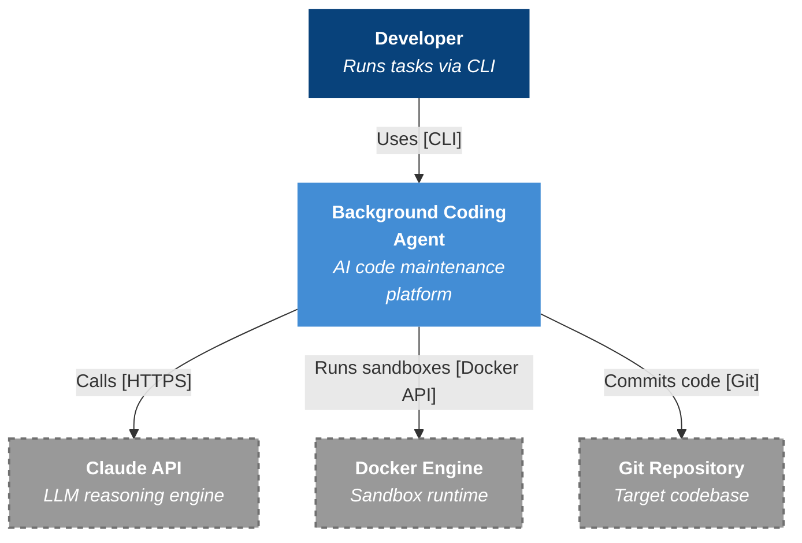
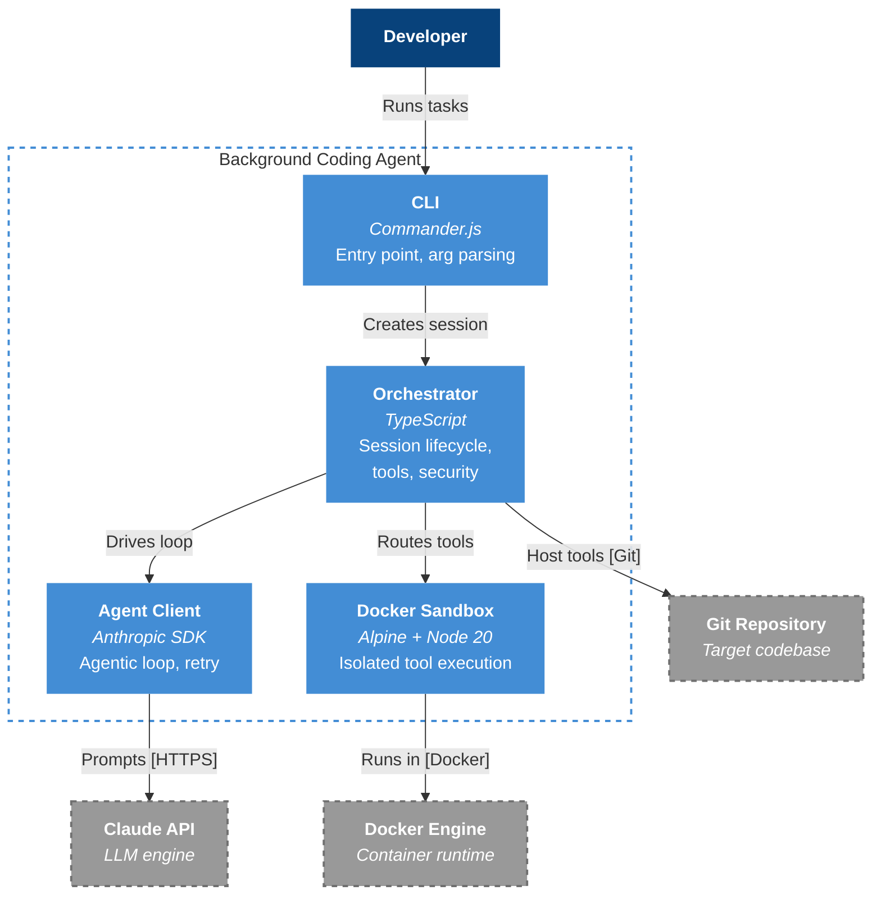
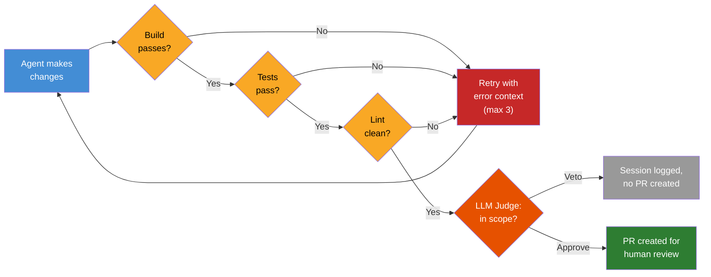

# Background Coding Agent

An AI-driven software maintenance agent that automates repetitive coding tasks — dependency updates, config changes, simple refactors — using Claude as the reasoning engine. The agent runs in isolated Docker containers, makes verified changes, and creates pull requests for human review.

**In one sentence:** An AI that does your team's chores, safely.

> Inspired by [Spotify's background coding agent architecture](https://engineering.atspotify.com/2025/11/spotifys-background-coding-agent-part-1) — their "Sandwich Pattern" that runs dependency updates across thousands of repos.

---

## Why This Exists

Every engineering team has a backlog of low-complexity, high-volume maintenance work:

| Task | Frequency | Manual Effort | Risk if Neglected |
|------|-----------|---------------|-------------------|
| Dependency updates | Weekly | 30–60 min/repo | Security vulnerabilities |
| Config migrations | Per release | 1–2 hours | Drift, outages |
| Simple refactors | Quarterly | Days | Tech debt compounds |

These tasks are **predictable**, **well-scoped**, and **verifiable** — the ideal profile for AI automation. Engineers skip them because they're tedious, and the backlog grows silently.

### Why an AI Agent (Not Just a Script)?

- **LLMs can reason about code** — Claude reads a codebase, plans changes, and executes edits across multiple files
- **Verification is solvable** — build/test/lint checks + an LLM Judge layer catch bad changes before they reach humans
- **Spotify proved it works** — their agent handles dependency updates at scale with a ~25% veto rate from their quality gate

### The Trust Model

> **"Student driver with dual controls"** — the agent writes code, but verification layers prevent bad changes from ever reaching production.

No auto-merge. Every change requires human approval. The agent handles the tedious work; engineers retain full control.

---

## Architecture

### System Context — Who Talks to What?

A **developer** triggers the agent via CLI. The agent coordinates between Claude API (for reasoning), Docker (for safe execution), and the target Git repository.



**Self-contained.** Only needs a Claude API key, Docker, and access to the target repo. No extra infrastructure.

### Inside the System — Four Containers



| Component | Role | Why It Exists |
|-----------|------|---------------|
| **CLI** | Entry point | Developers trigger runs with `background-agent run --task maven-update --repo ./myapp` |
| **Orchestrator** | Brain | Manages session lifecycle, enforces safety limits (10-turn cap, 5-min timeout) |
| **Agent Client** | LLM bridge | Drives the agentic loop — send prompt, get tool calls, execute, repeat |
| **Docker Sandbox** | Security boundary | All code reading/searching happens inside an isolated container with **no network access** |

### The Verification Pipeline

This is the core innovation — the reason the system can be trusted:



**Three layers of defense:**
1. **Deterministic checks** — build, test, lint must all pass
2. **LLM Judge** — a second Claude call evaluates the diff against the original task for scope creep (~25% veto rate expected)
3. **Human review** — PRs are never auto-merged

---

## Security — Defense in Depth

The agent is **untrusted by default**. Every layer assumes the layer above it might be compromised.

### What the Agent CAN Do

| Action | Mechanism | Constraint |
|--------|-----------|------------|
| Read files | `cat` via container exec | Within workspace only, path-validated |
| Edit files | Atomic write on host | Workspace-scoped, `0o644` permissions |
| Search code | `ripgrep` via container | Context lines capped at 50 |
| Run `find`, `head`, `tail`, `wc` | Container exec | No `-exec` or `-delete` flags |
| Git status, diff, add, commit | Host-side execution | Push blocked. `--no-verify` on commits |

### What the Agent CANNOT Do

| Blocked Action | How It's Blocked |
|----------------|-----------------|
| Access the network | `NetworkMode: none` on container |
| Run arbitrary commands | Static allowlist of 5 bash commands |
| Escalate privileges | `CapDrop: ALL` + `no-new-privileges` |
| Escape the workspace | Path traversal detection + null byte rejection |
| Push code | `push` not in git operation enum |
| Execute git hooks | `.git/hooks` path blocked + `--no-verify` |
| Spawn excessive processes | `PidsLimit: 100` |
| Exhaust memory | Configurable memory cap (default 512MB) |
| Write to system paths | Read-only root filesystem |

---

## Project Structure

```
background-coding-agent/
├── bin/
│   └── cli.js                    # CLI entry point
├── docker/
│   ├── Dockerfile                # Agent sandbox (Alpine + Node 20)
│   └── .dockerignore
├── src/
│   ├── cli/
│   │   ├── commands/
│   │   │   └── run.ts            # `background-agent run` command
│   │   ├── utils/
│   │   │   └── logger.ts         # Pino structured logging + PII redaction
│   │   └── index.ts              # Commander.js CLI setup
│   ├── orchestrator/
│   │   ├── agent.ts              # AgentClient — agentic loop with Claude
│   │   ├── container.ts          # ContainerManager — Docker lifecycle
│   │   ├── session.ts            # AgentSession — central hub + tool routing
│   │   ├── retry.ts              # RetryOrchestrator — retry on verification failure
│   │   ├── summarizer.ts         # ErrorSummarizer — context engineering
│   │   ├── verifier.ts           # Build/test/lint deterministic verifiers
│   │   ├── metrics.ts            # MetricsCollector — session tracking
│   │   └── *.test.ts             # Unit tests (vitest)
│   ├── errors.ts                 # Typed error classes
│   └── types.ts                  # Shared type definitions
├── .planning/                    # Planning docs, research, phase plans
├── ARCHITECTURE.md               # Detailed architecture overview
├── C4-ARCHITECTURE.md            # C4 model diagrams (Mermaid)
├── package.json
└── tsconfig.json
```

---

## Tech Stack

| Technology | Purpose |
|------------|---------|
| **TypeScript** | Primary language (ESM modules) |
| **Anthropic SDK** | Claude API integration (claude-sonnet-4-5) |
| **Dockerode** | Programmatic Docker container management |
| **Commander.js** | CLI framework |
| **Pino** | Structured JSON logging with PII redaction |
| **Vitest** | Unit testing framework |
| **ESLint v10** | Linting (flat config) |
| **Docker (Alpine 3.18 + Node 20)** | Agent sandbox runtime |

---

## Getting Started

### Prerequisites

- **Node.js** 18+
- **Docker** (running)
- **Anthropic API Key**

### Installation

```bash
git clone https://github.com/kiruba48/background-coding-agent-mvp.git
cd background-coding-agent

npm install
npm run build
```

### Build the Sandbox Image

```bash
docker build -t background-agent-sandbox -f docker/Dockerfile .
```

### Run the Agent

```bash
# Set your API key
export ANTHROPIC_API_KEY=sk-ant-...

# Run a task against a target repo
npx tsx src/cli/index.ts run \
  --task-type "Update lodash to latest version" \
  --repo /path/to/your/repo \
  --turn-limit 10 \
  --timeout 300
```

### Run Tests

```bash
# Unit tests
npm test

# All tests (unit + integration)
npm run test:all
```

---

## Current Progress

```
Phase 1   Foundation & Security      ██████████ Complete   (2026-01-27)
Phase 2   CLI & Orchestration        ██████████ Complete   (2026-02-06)
Phase 3   Agent Tool Access          ██████████ Complete   (2026-02-12)
Phase 4   Retry & Context Eng.       ██████████ Complete   (2026-02-17)
Phase 5   Deterministic Verification ██████████ Complete   (2026-02-18)
Phase 6   LLM Judge Integration      ░░░░░░░░░░ Next up
Phase 7   PR Creation                ░░░░░░░░░░
Phase 8   Maven Dependency Updates   ░░░░░░░░░░
Phase 9   npm Dependency Updates     ░░░░░░░░░░
Phase 10  Verification Plugin System ░░░░░░░░░░
```

**What's working today (Phases 1–5):** The agent spins up an isolated Docker sandbox, communicates with Claude, safely reads/edits files, runs Git operations with strict security boundaries, retries on verification failure with summarized error context, and runs deterministic build/test/lint verification.

**What's next (Phases 6–7):** LLM Judge for scope control, PR creation via GitHub API.

**Value delivery (Phases 8–9):** First real use cases — Maven and npm dependency updates, end-to-end.

---

## Design Principles

These principles, drawn from Spotify's production learnings, guide every decision:

| Principle | What It Means |
|-----------|---------------|
| **End-state prompting** | Describe the desired outcome, not the steps. Let the agent plan. |
| **Limited tools = predictability** | Allowlist, not denylist. 6 tools total. No arbitrary commands. |
| **Abstract noise** | Summarize build errors ("3 tests failed in AuthModule"), don't dump 10K lines. |
| **Sandbox everything** | Container isolation is non-negotiable. Network: none. Non-root. Read-only rootfs. |
| **Never skip verification** | Build, test, lint, LLM Judge — all must pass before a PR is created. |
| **One change per session** | Avoid context exhaustion. Dependency update OR refactor, never both. |
| **Human review required** | No auto-merge, ever. Trust is built by keeping engineers in control. |

---

## Key Metrics (Targets)

| Metric | Target | Why |
|--------|--------|-----|
| **Merge rate** | Track AI-generated PRs merged vs total | Measures value delivered |
| **Veto rate** | ~25% | LLM Judge working correctly (too low = too lenient) |
| **Time savings** | 60–90% reduction in manual effort | Core value proposition |
| **Turn count** | ≤10 per session | Cost control |

---

## Documentation

| Document | Description |
|----------|-------------|
| [ARCHITECTURE.md](./ARCHITECTURE.md) | Detailed architecture overview with security model |
| [C4-ARCHITECTURE.md](./C4-ARCHITECTURE.md) | C4 model diagrams (system context, container, component, dynamic) |
| [BRIEF.md](./BRIEF.md) | Original project brief with full phase breakdown |
| [.planning/ROADMAP.md](./.planning/ROADMAP.md) | 10-phase roadmap with success criteria |
| [.planning/REQUIREMENTS.md](./.planning/REQUIREMENTS.md) | Requirements traceability matrix |
| [.planning/research/](./.planning/research/) | Architecture patterns, pitfalls, stack decisions |

---

## Inspiration & References

- [Spotify's Background Coding Agent (Part 1)](https://engineering.atspotify.com/2025/11/spotifys-background-coding-agent-part-1) — Architecture overview
- [Context Engineering (Part 2)](https://engineering.atspotify.com/2025/11/context-engineering-background-coding-agents-part-2) — Prompt and tool design
- [Feedback Loops (Part 3)](https://engineering.atspotify.com/2025/12/feedback-loops-background-coding-agents-part-3) — Verification and quality gates

---

## License

MIT