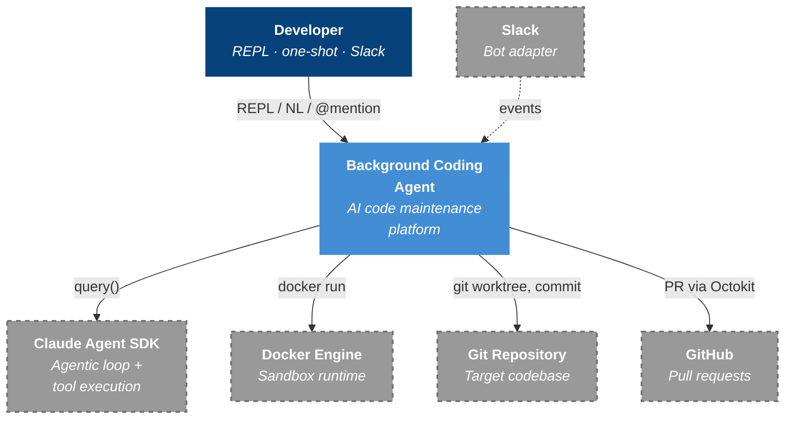
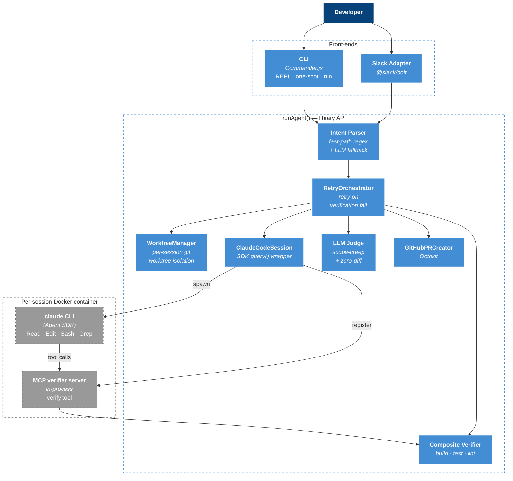
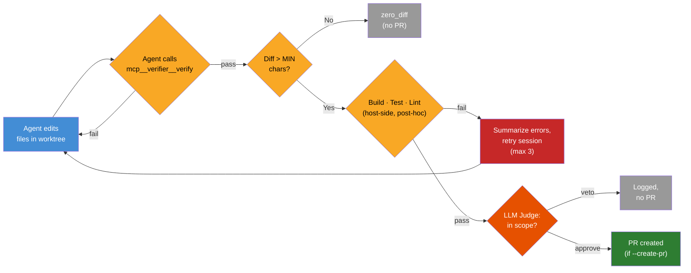

# Background Coding Agent

An AI-driven software maintenance agent that automates repetitive coding tasks — dependency updates, config changes, refactors, and read-only repo investigations — using the **Claude Agent SDK** as the reasoning engine. The agent runs in isolated, network-restricted Docker containers, makes verified changes, and creates pull requests for human review.

**In one sentence:** An AI that does your team's chores, safely.

> Inspired by [Spotify's background coding agent architecture](https://engineering.atspotify.com/2025/11/spotifys-background-coding-agent-part-1) — their "Sandwich Pattern" that runs dependency updates across thousands of repos.

---

## Why This Exists

Every engineering team has a backlog of low-complexity, high-volume maintenance work:

| Task | Frequency | Manual Effort | Risk if Neglected |
|------|-----------|---------------|-------------------|
| Dependency updates | Weekly | 30–60 min/repo | Security vulnerabilities |
| Config migrations | Per release | 1–2 hours | Drift, outages |
| Simple refactors | Quarterly | Days | Tech debt compounds |
| Repo investigations | Ad-hoc | 15–60 min | Onboarding friction |

These tasks are **predictable**, **well-scoped**, and **verifiable** — the ideal profile for AI automation. Engineers skip them because they're tedious, and the backlog grows silently.

### The Trust Model

> **"Student driver with dual controls"** — the agent writes code, but verification layers prevent bad changes from ever reaching production.

No auto-merge. Every change requires human approval. The agent handles the tedious work; engineers retain full control.

---

## Architecture

### System Context

A developer triggers the agent via the **CLI** (interactive REPL, one-shot natural-language input, or legacy flag-based `run`), or by `@mentioning` a Slack bot. The agent coordinates between the Claude Agent SDK (for reasoning), Docker (for safe execution), and the target Git repository / GitHub.



### Inside the System

The agent is structured as a library (`runAgent()`) wrapped by multiple front-ends. Every session creates an isolated git worktree, spawns a network-restricted container running the `claude` CLI, and exposes verification as an MCP tool the agent can call mid-session.



| Component | Role | Source |
|-----------|------|--------|
| **CLI** | Entry point — owns process signal handlers, routes to REPL / one-shot / `run` | `src/cli/index.ts`, `src/cli/commands/` |
| **Slack Adapter** | Bot mode — converts Slack events into intent parser input, posts confirmations and reports back as thread messages | `src/slack/` |
| **Intent Parser** | Resolves natural language to a typed `ResolvedIntent` (`npm-dependency-update` · `maven-dependency-update` · `generic` · `investigation`). Tries deterministic regex fast-paths first, falls back to a structured LLM parse | `src/intent/` |
| **`runAgent()`** | Library API — internalizes Docker checks, worktree lifecycle, orchestrator wiring. Returns a `RetryResult`; never terminates the process | `src/agent/index.ts` |
| **WorktreeManager** | Creates a sibling git worktree on a UUID-suffixed branch per session, writes a PID sentinel, cleans up in `finally`, and prunes orphans from crashed sessions at REPL startup | `src/agent/worktree-manager.ts` |
| **RetryOrchestrator** | Drives the verification retry loop. On failure, summarizes errors and re-runs the session up to `--max-retries` | `src/orchestrator/retry.ts` |
| **ClaudeCodeSession** | Wraps the Agent SDK's `query()` call. Builds the docker run command via a custom `spawnClaudeCodeProcess` so the SDK runs the `claude` CLI **inside** the sandbox container (not on the host) | `src/orchestrator/claude-code-session.ts` |
| **MCP verifier server** | An in-process SDK MCP server exposes `mcp__verifier__verify` so the agent can re-run build/test before declaring done. The system prompt instructs it to call this tool before stopping | `src/mcp/verifier-server.ts` |
| **Composite Verifier** | Build / test / lint runners. Auto-detects `package.json` (npm) or `pom.xml` (Maven). Lint runs after the agent finishes against a stashed working tree | `src/orchestrator/verifier.ts` |
| **LLM Judge** | Second Claude call that compares the diff against the original task description. Refactoring-aware. Catches scope creep (~25% target veto rate) | `src/orchestrator/judge.ts` |
| **GitHubPRCreator** | Optional, opt-in via `--create-pr`. Creates a branch, pushes the worktree HEAD, and opens a PR via Octokit | `src/orchestrator/pr-creator.ts` |
| **ProjectRegistry** | Persistent registry (via `conf`) of repos referred to by name (`"update lodash in ledger-api"`) | `src/agent/registry.ts` |

### The Verification Pipeline



**Four layers of defense:**
1. **In-loop self-verification** — the agent calls the MCP `verify` tool before declaring done; failing keeps it inside the same SDK turn budget
2. **Zero-diff guard** — sessions that produced no meaningful changes are short-circuited as `zero_diff` (no PR, no judge call)
3. **Deterministic verification** — composite build/test/lint outside the agent loop, with retry-on-fail (max 3) and summarized error context
4. **LLM Judge** — refactor-aware semantic check against the original task; ~25% target veto rate
5. **Human review** — PRs are never auto-merged

### Task Types

| Task type | Trigger | Path |
|-----------|---------|------|
| `npm-dependency-update` | `"update lodash to latest"`, fast-path regex, or `--task-type` | Worktree → SDK session → npm install on host (regenerates lockfile) → verify → judge → PR |
| `maven-dependency-update` | `"upgrade spring-core"`, or `--task-type` | Worktree → SDK session → verify → judge → PR |
| `generic` | Any free-form NL ("refactor the auth module"). Goes through scoping dialogue + LLM intent parsing | Worktree → SDK session → verify → judge → PR |
| `investigation` | `"explore the branching strategy"`, `"check the CI setup"`, `"what's the project structure"` | **No worktree.** Repo mounted `:ro`. PreToolUse hook blocks Write/Edit. Returns a markdown report inline (REPL) or as a thread message (Slack). No verifier, no judge, no PR |

---

## Security — Defense in Depth

The agent is **untrusted by default**. Every layer assumes the layer above it might be compromised.

### Sandbox

| Constraint | Mechanism |
|------------|-----------|
| **No arbitrary network egress** | Custom `agent-net` Docker network + iptables rules in `entrypoint.sh`. Only loopback, DNS, and TCP/443 to resolved Anthropic API IPs are allowed. All other egress is `DROP`ped. DNS resolution must succeed before the container starts (no degrade-to-allow-all). |
| **Read-only root filesystem** | `--read-only` + `tmpfs` for `/tmp` and `/home/agent` |
| **Non-root user** | `entrypoint.sh` runs as root only long enough to apply iptables, then `su-exec`s to UID/GID 1001 |
| **Capability drop** | `--cap-drop ALL` + `--cap-add NET_ADMIN,SETUID,SETGID` (NET_ADMIN needed for the entrypoint's iptables setup; SETUID/SETGID for `su-exec`) |
| **Privilege escalation blocked** | `--security-opt no-new-privileges` |
| **Process bomb resistance** | `--pids-limit 200` |
| **Memory cap** | `--memory 2g` |
| **IPv6 disabled** | `--sysctl net.ipv6.conf.all.disable_ipv6=1` |
| **Read-only investigation mode** | Workspace mounted `:ro` for `investigation` tasks; `PreToolUse` hook independently denies `Write` / `Edit` and a regex-blocklist of destructive Bash commands (defense in depth) |

### Host-side guards

| Guard | Source |
|-------|--------|
| Path traversal / symlink escape | `realpathSync` on both repo root and tool target before prefix check (`src/orchestrator/claude-code-session.ts`) |
| Sensitive-file write block | Regex blocklist for `.env*`, `.git/`, `*.pem`, `*.key`, `private_key*` |
| Push blocked from container | The container has no host git credentials; PR creation runs **host-side** via `GitHubPRCreator` after the session ends |
| Per-session worktree isolation | Concurrent sessions on the same repo never touch each other's working tree |

---

## Project Structure

```
background-coding-agent/
├── bin/
│   └── cli.js                          # CLI entry point shim
├── docker/
│   ├── Dockerfile                      # Multi-stage: Node 20 + JDK 17 + Maven + claude CLI
│   └── entrypoint.sh                   # iptables egress allowlist + su-exec drop
├── src/
│   ├── agent/
│   │   ├── index.ts                    # runAgent() library API
│   │   ├── worktree-manager.ts         # per-session git worktree lifecycle
│   │   └── registry.ts                 # ProjectRegistry (persistent named repos)
│   ├── cli/
│   │   ├── index.ts                    # Commander.js root, signal handlers
│   │   ├── commands/
│   │   │   ├── repl.ts                 # Interactive REPL mode
│   │   │   ├── one-shot.ts             # Natural-language one-shot mode
│   │   │   ├── run.ts                  # Legacy flag-based run command
│   │   │   ├── projects.ts             # Project registry commands
│   │   │   └── slack.ts                # `slack start` adapter command
│   │   ├── docker/
│   │   │   └── index.ts                # buildDockerRunArgs, image/network bootstrap
│   │   └── auto-register.ts            # Auto-add cwd to ProjectRegistry
│   ├── orchestrator/
│   │   ├── claude-code-session.ts      # Agent SDK query() wrapper, hooks, MCP wiring
│   │   ├── retry.ts                    # RetryOrchestrator + zero-diff handling
│   │   ├── verifier.ts                 # Build/test/lint composite verifier
│   │   ├── judge.ts                    # LLM Judge + diff capture
│   │   ├── pr-creator.ts               # GitHubPRCreator (Octokit)
│   │   ├── summarizer.ts               # ErrorSummarizer for retry context
│   │   └── metrics.ts                  # Per-session metrics collector
│   ├── intent/
│   │   ├── index.ts                    # parseIntent coordinator
│   │   ├── fast-path.ts                # Regex fast-paths (deps + exploration)
│   │   ├── llm-parser.ts               # Structured LLM intent parsing (Zod schema)
│   │   ├── confirm-loop.ts             # Interactive confirmation UI
│   │   ├── context-scanner.ts          # Manifest reader (package.json / pom.xml)
│   │   └── types.ts                    # TASK_TYPES, ResolvedIntent
│   ├── prompts/
│   │   ├── index.ts                    # buildPrompt switch by task type
│   │   ├── generic.ts                  # End-state prompt for free-form tasks
│   │   ├── npm.ts / maven.ts           # Dependency-update prompts
│   │   └── exploration.ts              # Investigation prompts (4 subtypes)
│   ├── repl/
│   │   ├── session.ts                  # REPL state machine + history append
│   │   └── types.ts                    # ReplState, TaskHistoryEntry
│   ├── slack/
│   │   ├── adapter.ts                  # processSlackMention — confirmation + history
│   │   ├── blocks.ts                   # Slack Block Kit builders
│   │   └── index.ts                    # @slack/bolt app bootstrap
│   ├── mcp/
│   │   └── verifier-server.ts          # In-process MCP server exposing verify tool
│   ├── errors.ts                       # TurnLimitError
│   └── types.ts                        # Shared types (SessionConfig, RetryResult, ...)
├── .planning/                          # Phases, roadmap, requirements, audits
├── ARCHITECTURE.md
├── C4-ARCHITECTURE.md
├── package.json
└── tsconfig.json
```

---

## Tech Stack

| Technology | Purpose |
|------------|---------|
| **TypeScript (ESM)** | Primary language |
| **`@anthropic-ai/claude-agent-sdk`** | Agentic loop, tool execution, MCP, hooks (replaces hand-rolled loop) |
| **`@anthropic-ai/sdk`** | Used directly only for the LLM Judge and the LLM intent parser |
| **`@slack/bolt`** | Slack adapter |
| **`octokit`** | GitHub PR creation |
| **`simple-git`** | Host-side git operations (commit / push / branch) |
| **`commander`** | CLI framework |
| **`conf`** | Persistent ProjectRegistry storage |
| **`zod`** | Intent schema validation |
| **`pino`** | Structured JSON logging with PII redaction |
| **`vitest`** | Unit + integration tests |
| **Docker** (Alpine + Node 20 + JDK 17 + Maven + `claude` CLI) | Sandbox runtime |
| **`iptables`** | In-container egress allowlist (only Anthropic API IPs reachable) |

---

## Getting Started

### Prerequisites

- **Node.js** 18+
- **Docker** (running)
- **`ANTHROPIC_API_KEY`**
- **`GITHUB_TOKEN`** — only needed for `--create-pr`
- **Slack app credentials** — only needed for `background-agent slack start`

### Install

```bash
git clone https://github.com/kiruba48/background-coding-agent-mvp.git
cd background-coding-agent

npm install
npm run build
```

The Docker image is built lazily on first run (via `buildImageIfNeeded`), so there is no separate build step.

### Run — three modes

**Interactive REPL (recommended):**
```bash
export ANTHROPIC_API_KEY=sk-ant-...
npx tsx src/cli/index.ts
```
You'll get a `bg>` prompt. Try:
```
bg> update lodash to latest in my-app
bg> explore the branching strategy
bg> refactor the auth module to use async/await
```

**Natural-language one-shot:**
```bash
npx tsx src/cli/index.ts "update lodash to latest in my-app" --create-pr
```

**Legacy flag-based:**
```bash
npx tsx src/cli/index.ts run \
  --task-type npm-dependency-update \
  --repo /path/to/your/repo \
  --dep lodash \
  --target-version latest \
  --create-pr
```

**Slack bot:**
```bash
export SLACK_BOT_TOKEN=xoxb-...
export SLACK_APP_TOKEN=xapp-...
export SLACK_SIGNING_SECRET=...
npx tsx src/cli/index.ts slack start
```

### Tests

```bash
npm test          # full vitest suite
npm run lint
```

---

## Current Progress

| Milestone | Phases | Status |
|-----------|--------|--------|
| **v1.0 — Foundation** | 1–6 (security, CLI, agent loop, retry, deterministic verification, LLM judge) | ✅ shipped 2026-03-02 |
| **v1.1 — End-to-End Pipeline** | 7–9 (PR creation, Maven + npm dependency updates) | ✅ shipped 2026-03-11 |
| **v2.0 — Claude Agent SDK Migration** | 10–13 (SDK integration, legacy deletion, MCP verifier, container strategy) | ✅ shipped 2026-03-19 |
| **v2.1 — Conversational Mode** | 14–17 (intent parser, REPL, multi-turn context) | ✅ shipped 2026-03-22 |
| **v2.2 — Deterministic Task Support** | 18–20 (intent generalization, generic prompt builder, safety) | ✅ shipped 2026-03-25 |
| **v2.3 — Conversational Scoping & REPL** | 21–24 (post-hoc PR, scoping dialogue, follow-ups, **Slack bot adapter**) | ✅ shipped 2026-04-05 |
| **v2.4 — Git Worktree & Repo Exploration** | 25–27 (tech debt cleanup, **git worktree isolation**, **repo exploration tasks**) | ✅ shipped 2026-04-06 |

**What's working today:** Interactive REPL with natural-language tasks, Slack bot integration, npm and Maven dependency updates with end-to-end PR creation, generic refactor tasks, read-only repo investigations, concurrent agent runs via per-session git worktrees, in-loop self-verification via MCP, LLM Judge scope enforcement, network-restricted Docker sandbox.

See [`.planning/ROADMAP.md`](./.planning/ROADMAP.md) for the full phase breakdown and [`.planning/REQUIREMENTS.md`](./.planning/REQUIREMENTS.md) for the requirements traceability matrix.

---

## Design Principles

These principles, drawn from Spotify's production learnings, guide every decision:

| Principle | What It Means |
|-----------|---------------|
| **End-state prompting** | Describe the desired outcome, not the steps. Let the agent plan. |
| **SDK over hand-rolling** | The Claude Agent SDK owns the agentic loop, tool routing, hooks, and MCP. We own task framing, safety, verification, and orchestration. |
| **Abstract noise** | Summarize build errors (`3 tests failed in AuthModule`), don't dump 10K lines into the retry context. |
| **Sandbox everything** | Container isolation is non-negotiable. Egress allowlisted to Anthropic only. Non-root. Read-only rootfs. PID and memory caps. |
| **Verify before declaring done** | The agent calls `mcp__verifier__verify` before stopping; the orchestrator re-verifies host-side after the session. |
| **One change per session** | Avoid context exhaustion. Dependency update OR refactor, never both. |
| **Worktree per session** | Concurrent runs on the same repo never collide; cleanup is best-effort in `finally`; orphans pruned at REPL startup. |
| **Read-only when reading** | Investigation tasks mount the repo `:ro` and block Write/Edit/destructive Bash via PreToolUse hook. |
| **Human review required** | No auto-merge, ever. |

---

## Documentation

| Document | Description |
|----------|-------------|
| [ARCHITECTURE.md](./ARCHITECTURE.md) | Detailed architecture overview with security model |
| [C4-ARCHITECTURE.md](./C4-ARCHITECTURE.md) | C4 model diagrams (system context, container, component, dynamic) |
| [BRIEF.md](./BRIEF.md) | Original project brief |
| [.planning/ROADMAP.md](./.planning/ROADMAP.md) | Roadmap with milestones and per-phase success criteria |
| [.planning/REQUIREMENTS.md](./.planning/REQUIREMENTS.md) | Requirements traceability matrix |
| [.planning/research/](./.planning/research/) | Architecture patterns, pitfalls, stack decisions |

---

## Inspiration & References

- [Spotify's Background Coding Agent (Part 1)](https://engineering.atspotify.com/2025/11/spotifys-background-coding-agent-part-1) — Architecture overview
- [Context Engineering (Part 2)](https://engineering.atspotify.com/2025/11/context-engineering-background-coding-agents-part-2) — Prompt and tool design
- [Feedback Loops (Part 3)](https://engineering.atspotify.com/2025/12/feedback-loops-background-coding-agents-part-3) — Verification and quality gates
- [Claude Agent SDK](https://docs.claude.com/en/api/agent-sdk) — The agentic loop, tools, hooks, and MCP wiring this project relies on

---

## License

MIT
